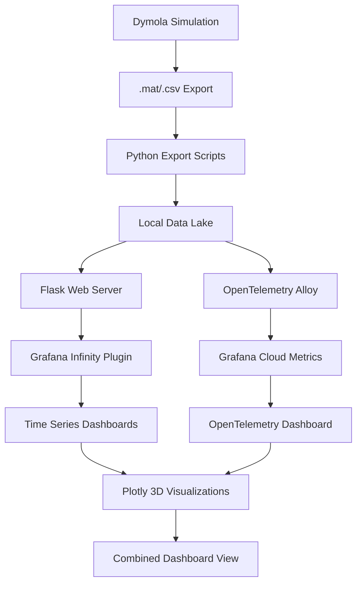

# Dymola-Grafana Cloud Visualization Demo

A comprehensive solution for visualizing Dymola simulation data in Grafana Cloud using OpenTelemetry Alloy, the Infinity plugin, and Plotly visualizations.

## 🏗️ Architecture Overview

This demo creates a complete pipeline that transforms Dymola simulation data into rich, interactive visualizations in Grafana Cloud:



## 🚀 Quick Start

### Prerequisites

- Python 3.8+
- Grafana Cloud account
- OpenTelemetry Alloy (optional)
- Dymola simulation files (.mat format)

### 1. Installation

```bash
# Clone the repository
git clone <repository-url>
cd dymola_grafanacloud_lab

# Install Python dependencies
pip install -r requirements.txt

# Create necessary directories
mkdir -p data/{raw,processed,metadata,archive} logs
```

### 2. Configuration

```bash
# Copy environment template
cp config/.env.example config/.env

# Edit with your Grafana Cloud credentials
nano config/.env
```

### 3. Start Services

```bash
# Start all services
./scripts/start_services.sh

# Check status
./scripts/start_services.sh status
```

### 4. Import Dashboards

1. Open Grafana Cloud
2. Import dashboards from `dashboards/` directory
3. Configure Infinity datasource pointing to `http://localhost:5000`

## 📁 Project Structure

```
dymola_grafanacloud_lab/
├── config/                 # Configuration files
│   ├── alloy-config.alloy  # OpenTelemetry Alloy configuration
│   ├── .env.example        # Environment variables template
│   └── grafana-datasources.yaml
├── dashboards/             # Grafana dashboard definitions
│   ├── dymola-simulation-dashboard.json
│   └── plotly-3d-dashboard.json
├── scripts/               # Python processing scripts
│   ├── dymola_export.py   # .mat to CSV converter
│   ├── data_server.py     # REST API for Grafana
│   ├── automation_pipeline.py # Real-time processing
│   └── start_services.sh  # Service startup script
├── data/                  # Data storage structure
│   ├── raw/              # Original .mat files
│   ├── processed/        # Converted CSV files
│   ├── metadata/         # Simulation catalogs
│   └── archive/          # Long-term storage
├── docs/                 # Documentation
│   └── best-practices.md # Comprehensive guide
└── logs/                 # Service logs
```

## 🔧 Components

### Data Processing Pipeline

1. **Dymola Export Scripts** (`scripts/dymola_export.py`)
   - Converts .mat files to CSV format
   - Extracts metadata and variable information
   - Supports batch processing

2. **Data Manager** (`scripts/data_manager.py`)
   - Organizes files in data lake structure
   - Maintains simulation catalog
   - Handles archiving and cleanup

3. **Web Server** (`scripts/data_server.py`)
   - REST API for Grafana Infinity plugin
   - Supports filtering, sampling, and aggregation
   - CORS-enabled for web access

### Monitoring and Collection

4. **OpenTelemetry Alloy** (`config/alloy-config.alloy`)
   - Monitors file system for new data
   - Collects metrics and forwards to Grafana Cloud
   - Configurable data sources and endpoints

5. **CSV Metrics Exporter** (`scripts/csv_metrics_exporter.py`)
   - Analyzes CSV files and exports Prometheus metrics
   - Variable statistics and simulation metadata
   - Health monitoring endpoints

### Automation

6. **Automation Pipeline** (`scripts/automation_pipeline.py`)
   - Real-time file monitoring with watchdog
   - Automatic processing of new simulations
   - Notification and alerting support

## 📊 Visualization Features

### Standard Grafana Panels

- **Time Series**: Temperature, velocity, pressure over time
- **Statistics**: Data points, simulation duration, variable counts
- **Tables**: Simulation listings with metadata

### Advanced Plotly Visualizations

- **3D Trajectories**: Multi-dimensional simulation paths
- **Surface Plots**: Temperature and pressure distributions
- **Phase Space**: Variable correlation analysis
- **Animation**: Time-based parameter evolution

### Dashboard Variables

- **Simulation Selection**: Dynamic dropdown of available simulations
- **Variable Filtering**: Choose which parameters to visualize
- **Time Range**: Filter data by simulation time

## 🔄 Usage Workflow

### 1. Data Export from Dymola

```python
# Manual export
python scripts/dymola_export.py simulation_results.mat --name "experiment_001"

# Batch processing
python scripts/dymola_export.py --batch /path/to/mat/files/
```

### 2. Automatic Processing

Place .mat files in `data/raw/` directory - they will be automatically:
- Converted to CSV format
- Organized in data lake structure
- Indexed in simulation catalog
- Made available to Grafana

### 3. Dashboard Access

1. **Time Series Analysis**: Use standard Infinity queries
2. **3D Visualization**: Import Plotly dashboard templates
3. **Custom Views**: Create specialized panels for specific variables

## 🔍 API Endpoints

The data server provides RESTful endpoints for Grafana:

```bash
# List all simulations
GET /simulations

# Get simulation data
GET /simulations/{id}?variables=temp,pressure&time_start=10&time_end=100

# Variable statistics
GET /simulations/{id}/variables/{variable}/stats

# Health check
GET /health

# Grafana-specific endpoints
GET /grafana/search              # Variable queries
GET /grafana/timeseries/{id}     # Time series data
```

## 📈 Example Queries

### Infinity Plugin Queries

```json
{
  "url": "http://localhost:5000/simulations/${simulation_id}?variables=temperature,pressure",
  "format": "table",
  "parser": "backend",
  "root_selector": "data"
}
```

### Plotly Configuration

```json
{
  "data": [{
    "x": "{datasource.data.*.time}",
    "y": "{datasource.data.*.temperature}", 
    "z": "{datasource.data.*.pressure}",
    "type": "scatter3d",
    "mode": "markers+lines"
  }]
}
```

## 🛠️ Customization Options

### Alternative Data Sources

- **Database Backend**: Replace file storage with PostgreSQL/InfluxDB
- **Cloud Storage**: Use S3/GCS for data lake
- **Stream Processing**: Add Kafka for real-time data

### Visualization Extensions  

- **Custom Panels**: Build specialized Grafana plugins
- **Additional Charts**: Heatmaps, scatter plots, gauges
- **Interactive Features**: Drill-down, annotations, alerts

### Integration Options

- **CI/CD**: Automate dashboard deployment
- **Notifications**: Slack, email, webhooks
- **Authentication**: LDAP, OAuth, SAML

## 📋 Monitoring and Operations

### Service Health

```bash
# Check all services
./scripts/start_services.sh status

# View logs
tail -f logs/data_server.log
tail -f logs/automation_pipeline.log
```

### Performance Metrics

- Processing times: < 30 seconds for typical files
- API response times: < 1 second for most queries  
- Dashboard load times: < 5 seconds

### Maintenance Tasks

- **Daily**: Check processing logs
- **Weekly**: Review disk usage, archive old data
- **Monthly**: Update dependencies, security patches

## 🔒 Security Considerations

- **API Authentication**: Implement API keys for production
- **Network Security**: Use HTTPS, VPN for remote access
- **Data Protection**: Encrypt sensitive simulation data
- **Access Control**: Role-based permissions in Grafana

## 🐛 Troubleshooting

### Common Issues

1. **Connection Errors**: Check service status and firewall
2. **Empty Dashboards**: Verify Infinity datasource configuration
3. **Slow Performance**: Implement data sampling and caching
4. **File Processing Failures**: Check .mat file format and permissions

### Debug Steps

```bash
# Test data server
curl http://localhost:5000/health

# Validate configuration  
python -c "import json; json.load(open('config/automation_config.json'))"

# Check processing
python scripts/dymola_export.py test_file.mat --name test
```

## 📚 Documentation

- **[Best Practices Guide](docs/best-practices.md)**: Comprehensive operational guide
- **[API Documentation](config/infinity-queries-examples.md)**: Query examples and endpoints
- **Code Comments**: Inline documentation in all scripts

## 🤝 Contributing

1. Fork the repository
2. Create feature branch: `git checkout -b feature/new-visualization`
3. Add tests for new functionality
4. Submit pull request with detailed description

## 📄 License

MIT License - see LICENSE file for details

## 🙋‍♀️ Support

- **Issues**: Open GitHub issues for bugs and feature requests
- **Documentation**: Check `docs/` directory for guides
- **Community**: Grafana Community Forums for visualization questions

---

**Ready to visualize your Dymola simulations?** Start with `./scripts/start_services.sh` and begin exploring your data in Grafana Cloud!